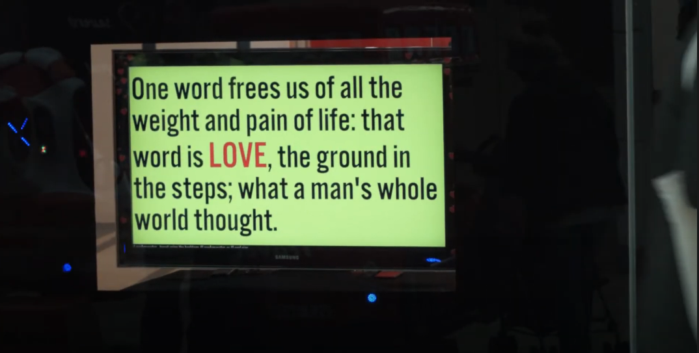

# LOVE APPARATUS
## 'you can´t fool people into loving you'
### A Creative AI installation

_LOVE APPARATUS_ is a Creative AI installation programmed in Python, and specially created for the [Art-AI Festival](https://www.art-ai.io/), in Leicester, UK. It runs on an NVIDIA Jetson board.

It generates love text aphorisms based on classic texts, poems and novels about love and on postings to the Twitter account [@apparatus_love](https://twitter.com/apparatus_love).

The public could interact with the apparatus by tweeting using the hashtag #LoveApparatus. The work itself, analysed the public contributions using an algorithm to identify its level of ‘loveliness’, and the ones with a high score are fed into the network to generate future love quotes.

Video: [YouTube](https://www.youtube.com/watch?v=8UIpAYbyCj8)

Interview for the BBC Radio Leicester: [SoundCloud](https://soundcloud.com/user-240321395/bbc-radio-leicester-fabrizio-poltronieri-love-apparatus-interview-3-may-2018)
